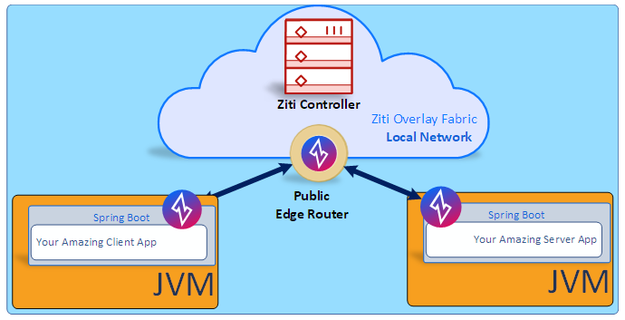

# Host a dark service with OpenZiti and Spring Boot &reg;

# Dark Service? Huh?
Open ports are everywhere. You _NEED_ open ports right? How are your users going to connect to your 
services if there are no open ports? Well that's exactly what a 'dark' server is. It's a server 
which has had zero trust principles applied to not just the network layer... No. The principles are 
baked directly into the application itself. 

Dark services have no listening ports, taking them off the scary internet where port scanners and 
nefarious actors are only an IP-hop away.

Let's talk a bit about what Zero Trust means. If you are here for the example, you can skip the 
reading and scroll down to
[An example of App Embedded Zero Trust](#an-example-of-app-embedded-zero-trust).

# What does Zero Trust mean?
The term Zero Trust is thrown around a lot lately, but what does it really mean?   

A formal description of Zero Trust: 
> Zero trust (ZT) is the term for an evolving set of cybersecurity paradigms that move defenses 
> from static, network-based perimeters to focus on users, assets, and resources. A zero trust 
> architecture (ZTA) uses zero trust principles to plan industrial and enterprise infrastructure 
> and workflows. Zero trust assumes there is no implicit trust granted to assets or user accounts 
> based solely on their physical or network location (i.e., local area networks versus the internet)
> or based on asset ownership (enterprise or personally owned). Authentication and authorization 
> (both subject and device) are discrete functions performed before a session to an enterprise 
> resource is established. Zero trust is a response to enterprise network trends that include 
> remote users, bring your own device (BYOD), and cloud-based assets that are not located within 
> an enterprise-owned network boundary. Zero trust focuses on protecting resources (assets, 
> services, workflows, network accounts, etc.), not network segments, as the network location is 
> no longer seen as the prime component to the security posture of the resource.

&mdash; <cite><a href="https://csrc.nist.gov/publications/detail/sp/800-207/final">NIST</a></cite>

Practically this boils down to a few basic tenants that apply to everything on your network, be they users or automated processes:
1. **Deny access by default:** Nobody can connect to the network unless you let them.
2. **Authorize on connect:** Only allow connections to the network which use a strong, well-defined and known identity.
3. **Explicit access grants:** Even if they can connect, actors can not do anything unless you let them. Limiting access prevents things like traversal attacks and information leakage.
4. **Enforce least privilege access:** Granting only permissions that are absolutely required for an actor to complete their tasks limits the damage that can be done when an account is compromised. 
5. **Constantly monitor for security compliance:** Zero trust is not just about the initial setup. It includes constantly monitoring policies, connections, and permissions to ensure that Zero Trust principles continue to be enforced over time. 

## Zero trust principles should not stop at the network
You can apply all of the Zero Trust principles to your network, but even after all of that work your application is still listening on a port. As long as there is a port open, your application can be attacked.

The concept of `App Embedded Zero Trust` moves the edge of the network into the application. Adding a Zero Trust sdk and bringing Zero Trust into your app has several benefits:
1. **No Listening Ports:** Your application can become totally dark with no open ports. No open ports means it cannot be scanned or attacked from any random person on the network.
2. **Zero Trust of the network:** Zero Trust of the wide-area, local-area and even OS network. Zero Trust of the OS network makes apps immune to network-based side-channel attacks from malicious actors or ransomware trying to attack the application from a stolen or infected device.
3. **Direct Access:** Applications are accessed directly from clients.
4. **Portability:** Once configured and part of the overlay, your application and your clients only need outbound, commodity internet.
- **Change Clouds:** Deploy your application into a new data center or a different cloud provider. Develop your app once and deploy it anywhere, it just works.
- **Mobile Clients:** Want to ssh from home OR the airport?  No problem! It doesn't matter where the client is, connectivity works from anywhere.
5. **Encrypted Data:** Application Data is encrypted from the client all the way to the server and back.
6. **Micro Segmentation:** Applications cannot talk to other applications unless authorized.

# An example of App Embedded Zero Trust
That's all interesting, but it's probably not why you clicked on this article. Let's get to the example!

We will use Open Ziti (https://openziti.github.io/) to provide the Zero Trust overlay network 
and application SDKs. We will use Spring Boot and Tomcat as the container to host the service.

## What you will need to get started
* About 30 minutes
* A favorite text editor or IDE
* JDK 11 or later
* Access to a Linux environment with Bash 
  * A VM or WSL2 works for Windows users 
  * Don't have access to a Linux environment? Grab a VM from the Oracle Cloud [free tier](https://www.oracle.com/cloud/free/)

## Get the code
The code can be downloaded from [here](https://github.com/netfoundry/openziti-spring-boot/releases) or clone it using Git:
```shell
 git clone https://github.com/netfoundry/openziti-spring-boot
```

Like most Spring guides, you can start from scratch and complete each step, or you can bypass basic 
setup steps that are already familiar to you. Either way, you end up with working code.

# Create the test OpenZiti network
This example will use a very simple OpenZiti network.

<p align="center">

</p>

It isn't important for this article to fully understand the components of the OpenZiti network. The important things to know are:
1. The controller manages the network. It is responsible for configuration, authentication, and authorization of components that connect to the OpenZiti network.
2. The router delivers traffic from the client to the server and back again.

Want to know more about an OpenZiti? Head over to https://openziti.github.io/ziti/overview.html#overview-of-a-ziti-network.

Let's get into it and create the test network!

## Get the OpenZiti quickstart shell extensions
OpenZiti provides a set of shell functions that bootstrap the OpenZiti client and network. As with any script, it is a good idea to download it first
and look it over before adding it to your shell.

Leave this terminal open, you'll need it to configure your network too.
 
```shell
# Pull the shell extensions
wget -q https://raw.githubusercontent.com/openziti/ziti/release-next/quickstart/docker/image/ziti-cli-functions.sh

# Source the shell extensions
. ziti-cli-functions.sh

# Pull the latest Ziti CLI and put it on your shell's classpath
getLatestZiti yes
```

## Start the OpenZiti network
The shell script you just downloaded includes a few functions to initialize a network.  

To start the OpenZiti network overlay, run this in the same terminal:
```shell
 expressInstall
 startZitiController
 waitForController
 startExpressEdgeRouter
```
* **expressInstall**: Creates cryptographic material and configuration files required to run an OpenZiti network.
* **startZitiController**: Starts the network controller.
* **startExpressEdgerouter**: Starts the edge router.

## Log into the new network
The OpenZiti network is now up and running. The next step is to log into the controller and 
establish the administrative session that we will use to configure the example services and identities.
`ziti-cli-functions` has a function to do this:
```shell
zitiLogin
```

## Configure the OpenZiti test network
We'll use a script to configure the OpenZiti network.

The code for the example contains a network directory.  
To configure the network, run this in the same terminal you used to start the OpenZiti network:
```shell
./express-network-config.sh
```

If the script errors with a lot of `ziti: command not found` then you can re-run this first to put 
ziti back in your terminal path:
```shell
getLatestZiti yes
```

The script will write out the two identity files (client.json and private-service.json) that you will need for the Java code.

The repository includes a file called `NETWORK-SETUP.md` if you want to learn more about what the script is doing and why.

# Resetting the Ziti demo network
You're done with this article or things have gone really off the rails, and you want to start over.  

There are a couple of commands that need to be run to stop the Ziti network and clean up.
```
stopAllEdgeRouters
stopZitiController
unsetZitiEnv
rm -rf ~/.ziti/quickstart
```

# Host a dark service using Spring Boot
There are three things that need to be done to host an OpenZiti service in a Spring Boot application:

1. Add the OpenZiti spring boot dependency.
2. Add two properties to the service to configure the service identity and service name.
3. Add an OpenZiti Tomcat customizer to the main application component scan.

The example code contains an initial/server project. Pull that up in your favorite editor and follow along.

## Add the OpenZiti spring boot dependency
The openziti spring boot dependency is hosted on maven central.  

Add the following to build.gradle:
```kotlin
implementation 'org.openziti:ziti-springboot:0.23.12'
```

If you prefer maven, add the following to pom.xml:
```xml
<dependency>
         <groupId>org.openziti</groupId>
         <artifactId>ziti-springboot</artifactId>
         <version>0.23.12</version>
</dependency>
```
## Add application properties
Open the application properties file: `src/main/resources/application.properties`

The Tomcat customizer provided by OpenZiti needs an identity and the name of the service that the identity will bind. If you followed along with the network setup above, then the values will be:
```
ziti.id = ../../network/private-service.json
ziti.serviceName = demo-service
```

## Configure the OpenZiti Tomcat customizer
The Tomcat customizer replaces the standard socket protocol with an OpenZiti protocol that knows 
how Bind a service to accept connections over the Ziti network. To enable this adapter, open up the
main application class `com.example.restservice.RestServiceApplication`.

Replace
```
@SpringBootApplication
```

With
```
@SpringBootApplication (scanBasePackageClasses = {ZitiTomcatCustomizer.class, GreetingController.class})
```

## Run the application
That’s all you need to do!  The OpenZiti Java SDK will connect to the test network, authenticate, 
and bind your service so that other OpenZiti overlay network clients can connect to it.

To run the application, enter the following in a terminal window (in your project directory)
```shell
./gradlew bootRun
```

If you use maven, run the following in a terminal window in your project directory:
```shell
./mvnw spring-boot:run
```

# Test your new Spring Boot service
The Spring Boot service you have just created is now totally dark. It has no listening ports at all. 
Go ahead - run `netstat` and find out for yourself!

```shell
netstat -anp | grep 8080
```

You should find nothing `LISTENING`. Now, the only way to access it is via the OpenZiti network!
Let’s write a simple client to connect to it and check that everything is working correctly.

This section will use the OpenZiti Java SDK to connect to the OpenZiti network. The example source 
includes a project and a class that takes care of the boilerplate stuff for you.

If you want to skip building the client then you can skip ahead to [Run The Client](#run-the-client).

## Connect to OpenZiti
The Java SDK needs to be initialized with an OpenZiti identity. It is polite to destroy the context 
once the code is done, so we’ll wrap it up in a `try/catch` with a `finally` block.

```java
ZitiContext zitiContext = null;
try {
  zitiContext = Ziti.newContext(identityFile, "".toCharArray());
  long end = System.currentTimeMillis() + 10000;

  while (null == zitiContext.getService(serviceName) && System.currentTimeMillis() < end) {
    log.info("Waiting for {} to become available", serviceName);
    Thread.sleep(200);
  }

  if (null == zitiContext.getService(serviceName)) {
    throw new IllegalArgumentException(String.format("Service %s is not available on the OpenZiti network",serviceName));
  }
} catch (Throwable t) {
  log.error("OpenZiti network test failed", t);
}
finally {
  if( null != zitiContext ) zitiContext.destroy();
}
```
* **Ziti.newContext:** Loads the OpenZiti identity and starts the connection process.
* **while:** It can take a little while to establish the connection with the OpenZiti 
network fabric. For long-running applications this is typically not a problem, but for this little
client we need to give the network some time to get everything ready.
* **zitiContext.destroy():** Disposes of the context and cleans up resources locally and on the 
OpenZiti network.

## Send a request to the service
The client has a connection to the test OpenZiti network. Now the client can ask OpenZiti to dial the service and send some data.

This client is for demonstration purposes only. You would never write a raw HTTP request like this 
in a real app. OpenZiti has a couple of examples using OKHttp and Netty if you want to work this 
code up using a real HTTP client. The examples can be found at 
https://github.com/openziti/ziti-sdk-jvm/tree/main/samples. 

```java
log.info("Dialing service");
ZitiConnection conn = zitiContext.dial(serviceName);
String request = "GET /greeting?name=MyName HTTP/1.1\n" +
"Accept: */*\n" +
"Host: example.web\n" +
"\n";
log.info("Sending request");
conn.write(request.getBytes(StandardCharsets.UTF_8));
```
* **ZitiConnection:** A socket connection over the OpenZiti network fabric that can be used to exchange data with a Ziti service.
* **zitiContext.dial:** Dialing a service opens a connection through the OpenZiti to the service.
* **request:** The connection is essentially a plain socket. The contents of the request string is a plain HTTP GET to the greeting endpoint in the Spring Boot app.
* **con.write:** Sends the request over the OpenZiti network.

## Read the service response
The service will respond to the request with a json greeting. Read the greeting and write it to the log.
```java
byte[] buff = new byte[1024];
int i;
log.info("Reading response");
while (0 < (i = conn.read(buff,0, buff.length))) {
  log.info("=== " + new String(buff, 0, i) );
}
```
* **con.read:** Read data sent back from the Spring Boot service via the OpenZiti connection.

## Run The Client
To run the client, run the following in a terminal window (in the client project):
```shell
./gradlew build run
```

If you use maven, run the following in a terminal window (in the client project):
```shell
./mvnw package exec:java
```
# Dig Deeper
* **OpenZiti documentation:** https://openziti.github.io/ziti/overview.html
* **OpenZiti Github project:** https://github.com/openziti 
* **Spring Boot Rest Sample:** https://spring.io/guides/gs/rest-service/
* **NetFoundry hosted OpenZiti NaaS offering:** https://netfoundry.io

**Spring and Spring Boot are trademarks of Pivotal Software, Inc. in the U.S. and other countries.*
