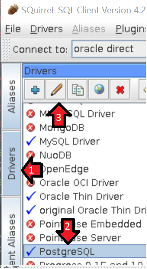
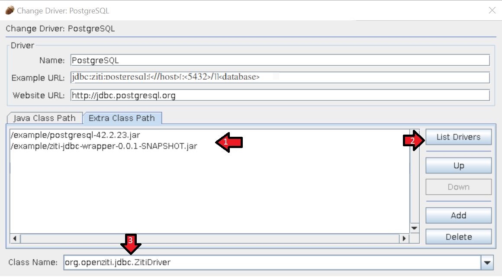
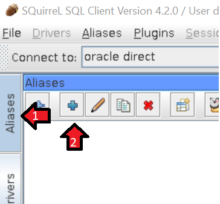
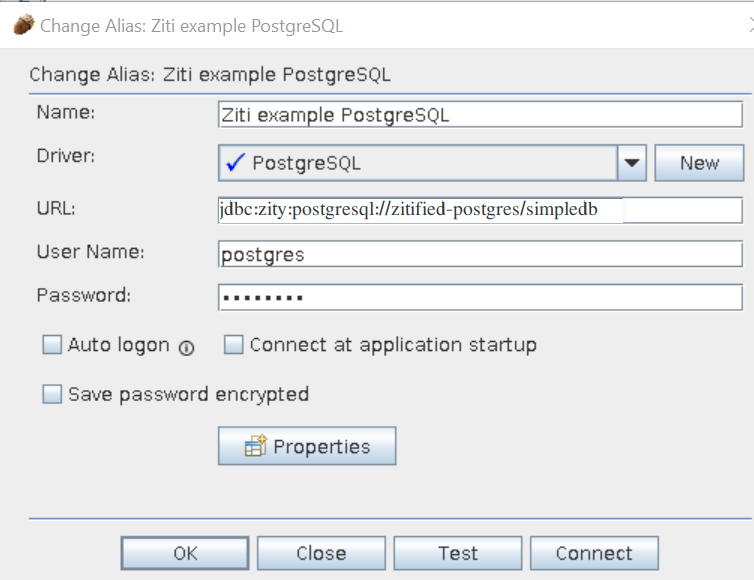
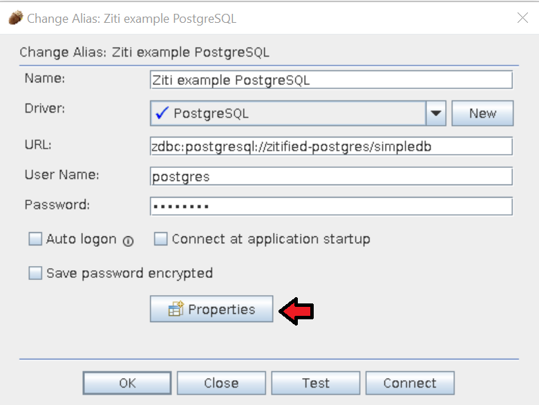
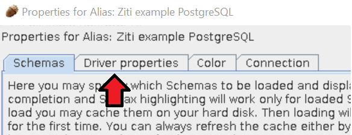
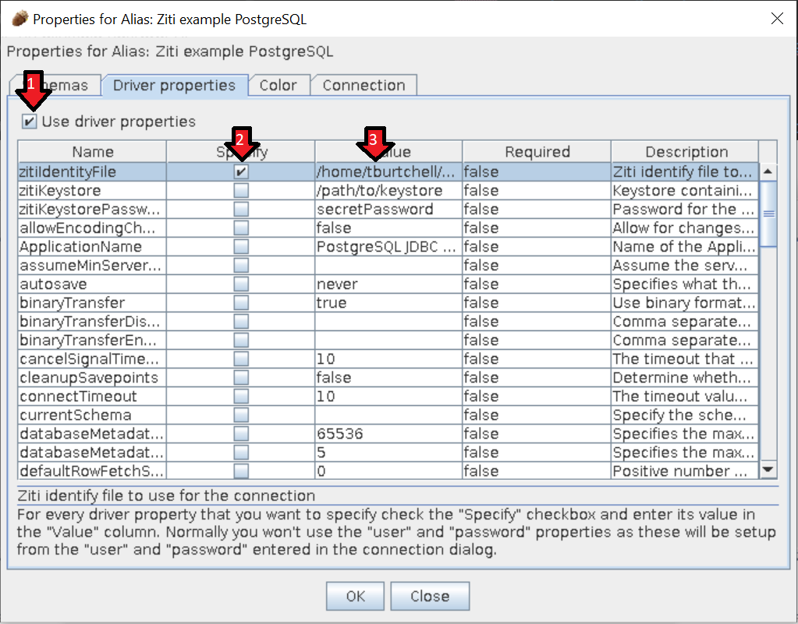

# ZDBC
A repository to provide jdbc driver configurations for access to databases via ziti

# Overview
## Goal
The goals of this project are:

1. Provide a set of tools to automatically configure existing JDBC drivers to connect via a Ziti network.
1. Leave the JDBC drivers provided by the vendor alone. This project does not include forks of any JDBC drivers.
1. Provide a way to connect developer tools to a database over a Ziti network.

## Driver Features
Each JDBC driver needs specific ziti features in order to work. This table attempts to capture which each driver requires

| Driver | Shim Included | Ziti Features | Notes |
| ------ | :------------:| ------------- | ----- |
| org.postgresql.Driver | Y | Socket Factory | Requires jdbc property socketFactory |
| oracle.jdbc.OracleDriver | Y | init with seamless mode | <ul><li>The current Oracle shim does not support NIO or OOB. As such, the shim will set the following property values <ul><li>oracle.jdbc.javaNetNio=false</li><li>oracle.net.disableOob=false</li></ul></li><li>Tested with public and private autonomous databases</li><li>Requires the database host to be resolvable (1)</li></ul> |
| com.mysql.jdbc.Driver | Y | init with seamless mode | |
| org.h2.Driver | N | init with seamless mode | Requires the database host to be resolvable (1) |

(1) These drivers attempt to resolve the name of the database host via a DNS request before connecting to them. The database hostname must be resolvable until something like <https://openjdk.java.net/jeps/418> is adopted. No connection attempt will be made to this host, it is simply required to satisfy the driver DNS resolution.

# How it works
The zdbc driver registers with `java.sql.DriverManager` when the zdbc wrapper jar is included in the application. The Ziti JDBC wrapper checks each database URL to see if it starts with `zdbc` or `jdbc:ziti`. If it does, then the wrapper accepts the connection request, configures Ziti,  configures the driver,  and then delegates to the driver to establish a database connection over the Ziti network fabric.

# Your Ziti network identity
The zdbc driver needs your ziti network identity to connect. There are three ways to give your identity to the driver.
1. PKCS12 keystore and password. Provided via the JDBC properties `zitiKeystore` and `zitiKeystorePassword`
1. Path to a `.json` file containing your ziti identity. This is the file created during enrollment. Provided via the JDBC property `zitiIdentityFile`
1. A zipped and base64encoded string provided via the JDBC property `zitiIdentity`. The zdbc jar provides a main method that can encode the json ziti identity file into this format. This option is intended to be used for support tooling or business application deployments where you cannot write to the server file system.

# Example of integrating into developer tools
## Requirements
1. A Ziti network and database: (https://github.com/openziti/ziti-sdk-jvm/blob/main/samples/jdbc-postgres/cheatsheet.md) 
1. Squirrel-Sql client: (http://squirrel-sql.sourceforge.net/#installation)
1. Postgresql JDBC driver: (https://search.maven.org/artifact/org.postgresql/postgresql)
1. Ziti ZDBC wrapper full jar: (this project): (https://search.maven.org/search?q=g:org.openziti&a=ziti-jdbc&l:full)

## Step by Step
1. Configure a ziti network and postgres database following the cheatsheet <https://github.com/openziti/ziti-sdk-jvm/blob/main/samples/jdbc-postgres/cheatsheet.md> 
1. Copy the Ziti all-in-one jar into the Squirrel-Sql `lib` folder

> ls $SQUIRREL_HOME\lib | grep ziti  
  ziti-jdbc-0.23.14-full.jar

1. Start Squirrel-Sql
1. Configure the Squirrel-Sql PostgreSQL driver
    1. Add the PostgreSQL jar file to the driver's `Extra Class Path`
    1. Click 'List Drivers' and select `org.openziti.jdbc.ZitiDriver` in the `Class Name` field
     
     
1. Create a PostgreSQL alias with the following values
    1. Name: `Ziti example PostgreSQL`
    1. Driver: `PostgreSQL`
    1. URL: `jdbc:zity:postgresql://zitified-postgres/simpledb`
    1. User Name: `postgres`
    1. Password: `postgres`
    1. The Ziti Identity file is provided via driver properties.  Click the Properties button and set the zitiIdentityFile property to the java-identity.json file created during the network setup
     
     
     
     
     

# Example of integrating into a Java application
This repository includes a coupld of examples using Java to connect to a dark database.
* [samples/postgresql/README.md](samples/postgresql/README.md): Postgresql example using the JDBC DriverManager to connect to a dark database.
* [samples/spring-jpa/README.md](samples/spring-jpa/README.md): A learning excercise adding spring-data-jpa and spring-data-rest to host a dark http server that connects to a dark postgres database
